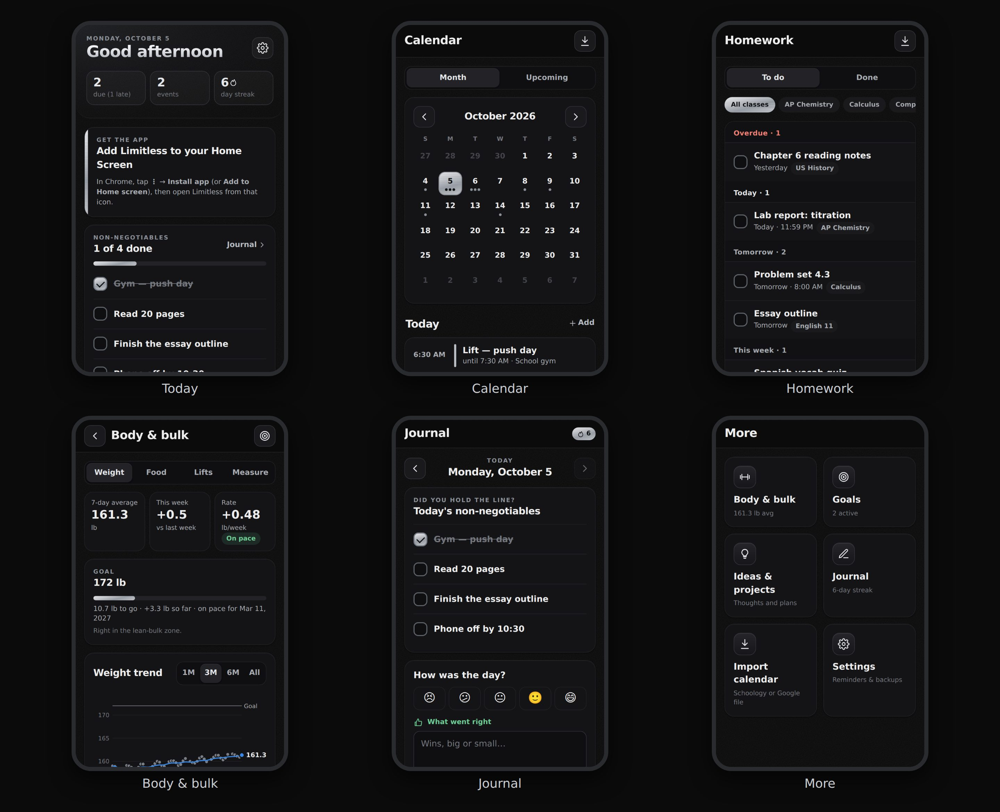

# Limitless

A personal life dashboard that lives on your phone's Home Screen, in matte black with brushed-silver accents. It runs entirely on your phone: there's no server and no account, and nothing you enter leaves the device. It's hosted free on GitHub Pages.



- **Today**: your non-negotiables checklist, today's schedule, homework due, bulk progress, goals, and a journal prompt.
- **Calendar**: month and upcoming views of your events and homework due dates.
- **Calendar sync**: your Apple Calendar and Schoology homework update by themselves every few hours (set up once; see below).
- **Homework**: grouped by Overdue, Today, Tomorrow, This week and Later, with class filters. Add assignments yourself, sync them from Schoology, or import a calendar file.
- **Journal**: what went right, what went wrong, and the **non-negotiables for tomorrow**, which become tomorrow's checklist. The app tracks your streak.
- **Daily prompts**: a new reflection question every day (sometimes shaped by what's going on, like a goal coming due or non-negotiables slipping), plus a **memory recall** question about your own past entries, spaced 1, 3, 7, 14, 30 and 60 days back. Answer from memory, then reveal what you actually wrote. Made on your phone: no AI service, no cost, and nothing leaves the device.
- **Body & bulk**: daily weigh-ins with a 7-day average trend chart, weekly gain rate with an "on pace" check, a goal projection, calories and protein, lifts with estimated 1-rep max, and tape measurements.
- **Goals**: each goal has milestones or a number to hit, plus a progress bar.
- **Ideas & projects**: an idea inbox for quick thoughts. You can turn any idea into a project with tasks and notes.
- **Reminders**: Limitless adds daily alerts (plan your day, weigh-in, homework check, journal) to your phone's own **Calendar app**, so you're alerted even when Limitless is closed. Any assignment or event can be added there too, with an alert before it's due.
- **Backups**: export everything to a file and restore it on any phone.

> The earlier server version (email alerts, appointments found in email, push notifications) is saved on the [`email-feature`](../../tree/email-feature) branch. It needs an always-on server, so it can't run on GitHub Pages.

## Open it on your phone

Your app's address is **https://noaharrison09-ux.github.io/Limitless/**

**iPhone**
1. Open the address in **Safari**.
2. Tap **Share → Add to Home Screen**.
3. Always open Limitless from that Home Screen icon. On iPhone, the Home Screen app keeps its own data, separate from Safari, so start entering things there.

**Android**
1. Open the address in **Chrome**.
2. Tap **⋮ → Install app** (or **Add to Home screen**) and open it from the icon.

It works offline after the first visit.

## Set up reminders

1. Open **More → Settings → Reminders** and pick your times.
2. Tap **Add daily reminders to my phone**.
   - **iPhone:** choose **Save to Files**, then open the Files app, tap `limitless-reminders.ics`, and tap **Add All**.
   - **Android:** choose your Calendar app, or open the downloaded file.
3. Your Calendar app now alerts you at those times every day. If you change the times later, delete the old Limitless reminders in your Calendar app and add them again.

## Sync Apple Calendar and Schoology automatically

Every 3 hours, GitHub downloads your calendars, locks them with a passphrase only you know, and publishes the locked file next to the app. Limitless unlocks it whenever you open the app. Synced events are read-only in Limitless: change them in Apple Calendar.

1. **Make up a passphrase**: four or more random words, at least 16 characters.
2. **Get your Apple Calendar link**: on your iPhone open **Calendar → Calendars**, tap **ⓘ** next to your calendar, turn on **Public Calendar**, tap **Share Link → Copy**. Anyone who has this link can view that calendar, so only paste it into GitHub's secrets.
3. **Get your Schoology link**: in Schoology open **Calendar**, tap **iCal/Export**, and copy the link.
4. **Add three secrets on GitHub**: in this repo go to **Settings → Secrets and variables → Actions → New repository secret** and add:
   - `SYNC_PASSPHRASE`: your passphrase
   - `CALENDAR_ICAL_URL`: the Apple Calendar link
   - `SCHOOLOGY_ICAL_URL`: the Schoology link

   For more than one calendar, put each link on its own line.
5. **Run it once**: open **Actions → Deploy to GitHub Pages → Run workflow** and wait about two minutes.
6. **On your phone**: open Limitless → **Settings → Calendar sync**, type the passphrase, and tap **Save and sync**.

**What's public and what isn't.**
- The calendar links and passphrase are GitHub secrets: hidden from everyone, and blanked out of the workflow logs.
- Only one small script (`scripts/sync-calendars.ts`, Node built-ins only) ever sees the links. It runs in its own job with no npm packages installed and a read-only GitHub token, so no outside code runs next to your secrets.
- The published file (`sync/data.json`) is encrypted with AES-256 using a key made from your passphrase (16+ characters required), so it's unreadable without it. It's padded to a fixed size bucket, so its size doesn't reveal how much is on your calendar. All anyone can tell is when it was last updated.
- Your journal, weight and everything else you type never leave your phone.

**If it stops updating:** GitHub pauses scheduled workflows in public repos after 60 days without any commits. Limitless warns you on the Settings screen. Open **Actions → Deploy to GitHub Pages** and tap **Enable workflow** (or **Run workflow**).

## Import a calendar file instead

1. In Safari, sign in to Schoology, open **Calendar**, tap the **iCal/Export** button, and copy the link.
2. Paste it into the address bar, change `webcal://` to `https://`, open it, and save the file (**Share → Save to Files**).
3. In Limitless, go to **More → Import calendar**, choose **As homework**, and pick the file.

For a one-off import without setting up sync: import again whenever you like. Only new assignments are added, and anything you've checked off or removed stays that way. A Google Calendar export (Settings → Import & export → Export) can be imported **As calendar events** the same way.

## Your data

Everything is stored in a small database on your phone. Use **Settings → Back up** now and then and save the file somewhere safe (iCloud Drive, Google Drive). If you switch phones or clear your browser data, **Restore** brings everything back.

## Publishing (GitHub Pages)

Every push to `main`, and a schedule every 3 hours, runs `.github/workflows/deploy-pages.yml`. It installs dependencies, typechecks, runs the tests, builds, syncs your calendars (if the secrets are set), and publishes the site. GitHub only accepts the deployment from the repo's default branch. One-time setup: in the repo's **Settings → Pages**, set **Source** to **GitHub Actions**.

## Development

Requires Node.js 22 or newer.

```bash
npm install
npm run dev        # http://localhost:5173
npm test           # unit + API tests (runs the same SQLite engine as the phone)
npm run typecheck
npm run build      # static site in dist/
```

### How it's built
- `web/src/pages`: the screens (React). They "call an API" (`/today`, `/homework`, …) like a normal web app.
- `web/src/core`: that API, running inside the page. It has a tiny router (`router.ts`), routes in `routes/`, and SQLite compiled to WebAssembly ([sql.js](https://sql.js.org)) in `db.ts`. The database file is saved to the phone's storage (IndexedDB) after every change, by `web/src/lib/localApi.ts`.
- `web/src/core/calendarFiles.ts`: calendar files in (Schoology/Google `.ics` → homework or events) and out (reminders and due dates with alerts for the phone's Calendar app).
- `web/src/core/prompts.ts`: the daily journal prompts and memory-recall questions, made on the phone from your own entries.
- `scripts/sync-calendars.ts` (runs on GitHub) and `web/src/core/sync.ts` (runs on the phone): calendar sync. The script downloads and encrypts (PBKDF2-SHA256 → AES-256-GCM); the app decrypts with WebCrypto and imports.
- `web/public/sw.js`: the service worker that lets the app load offline from the Home Screen.
- `scripts/make-icons.mjs`: regenerates the app icons.
